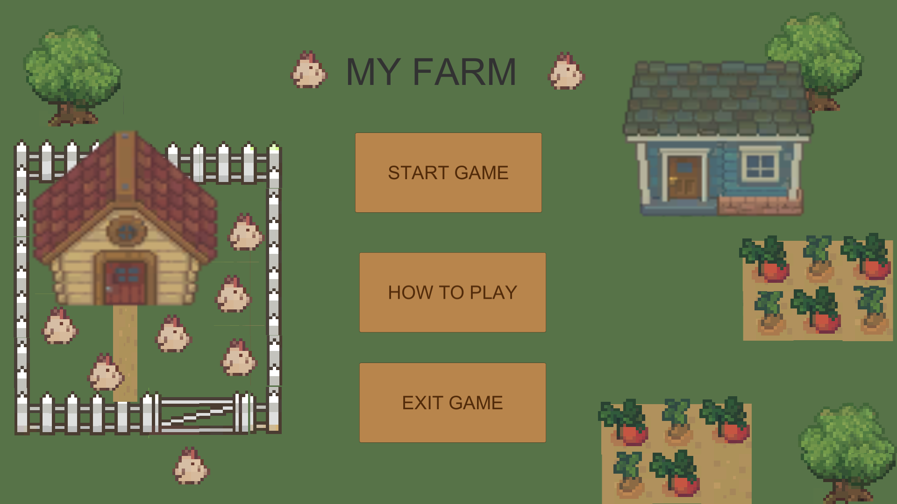
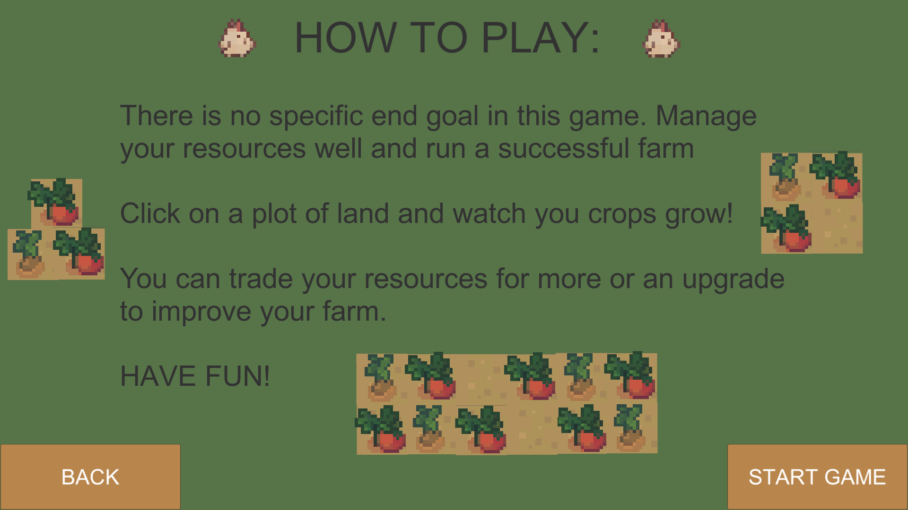
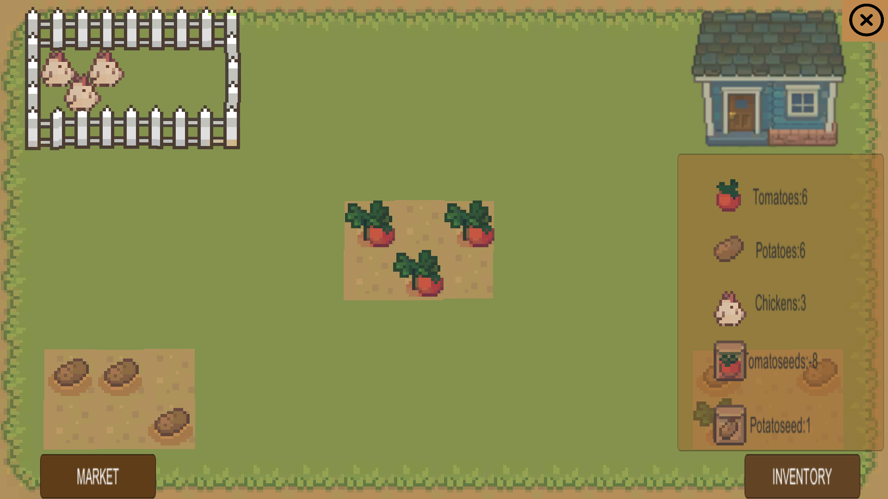
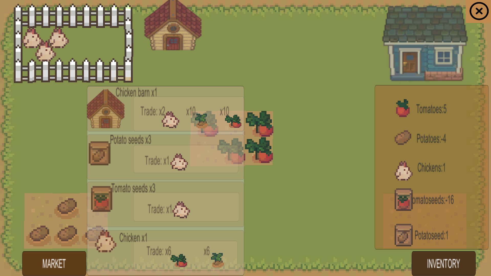

# Resource Management Simulation
Digital Game prototype

# MY FARM (Prototype)

**Created:** 2022  
**Engine:** Unity  
**Style:** 2D, Partial Pixel Art  
**Genre:** Resource Management Simulation

---

##  What Is This Game?

Barter Farm is a 2D farming simulation prototype where **there’s no money** — just **trading**.

Players grow crops, raise livestock, and **barter** with NPCs to expand and manage their farm. Instead of using traditional currency, you trade goods directly, making every decision more strategic.

- Start with a small pack of seeds and a couple of chickens  
- Plant, harvest, store, and trade resources  
- Handle random events that can disrupt your plans  
- Upgrade your farm to improve efficiency  
- Define your own goals — no fixed endgame

---

## Core Features

- **Barter Economy**: No money involved — trade items directly  
- **Risk vs Reward**: Make meaningful decisions about what and when to trade  
- **Accessible UI**: Clean layout with collapsible panels  
- **Inclusive Design**: Color-blind palettes, dyslexia-friendly font, clear icons  
- **Pixel Art Style**: Clean, readable visuals

---

## 🖼Screenshots

### Gameplay

### Trading Interface

